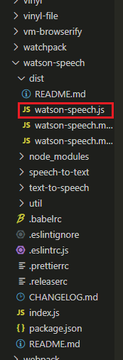
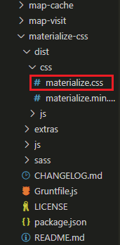
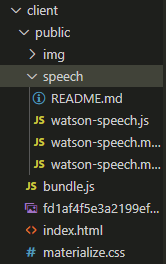

# pep-talker 🔊
Did someone mention a need for a rousing speech? Look no further. Browse a selection of inspirational quotes and have them read aloud by a text-to-speech module from IBM Cloud.

## Usage
### Clicking on 'Speak to me' will read the current quote out loud. 

### Click the 'I need something' button to select a random quote from the list.

### Write new quotes and select them from the list.

## Installation
1. Install dependencies.

    `npm install`
2. Seed database.

    `npm run seed`
3. Create a `speech` folder within the `public` directory.

4. Navigate to `node_modules/watson-speech/dist`. 

   Copy `watson-speech.js` into the newly-created `public/speech` directory.

   

5. Navigate to `node_modules/materialize-css/dist/css`.

   Copy `materialize.css` into the `public` directory.

   

6. Obtain valid credentials to use IBM Cloud's Text-to-Speech services. (https://www.ibm.com/cloud/watson-text-to-speech)

7. Create a `.env` file in the root directory. Place your API credentials within your `.env` file, similar to `example.env`.

9. Create webpack bundle.

    `npm run build`
   
   The `public` directory should look something like this: 

   

10. Start server.
    
    `npm run start-prod`

11. Navigate to [localhost:8080](http://localhost:8080)

